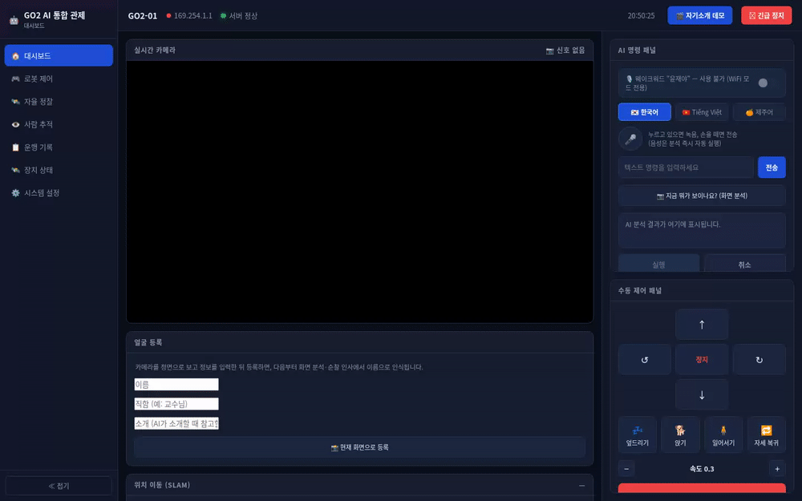
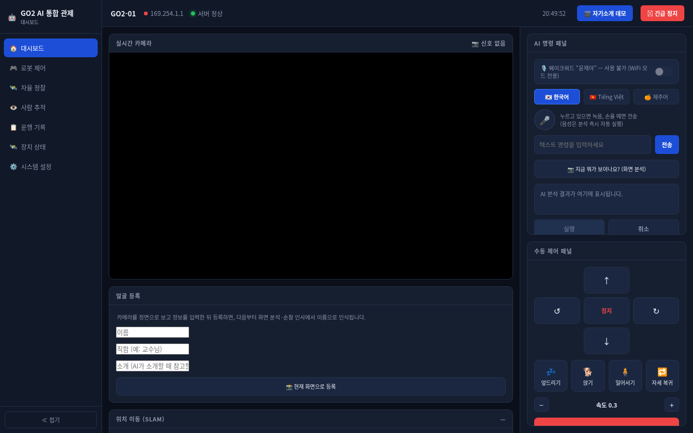
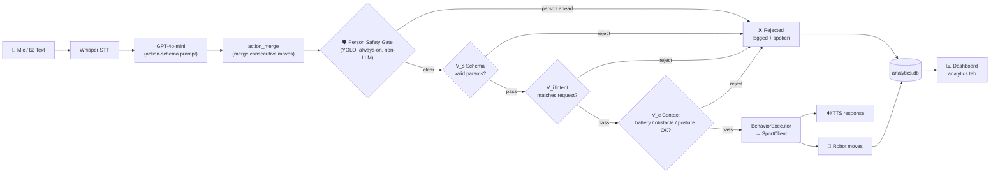
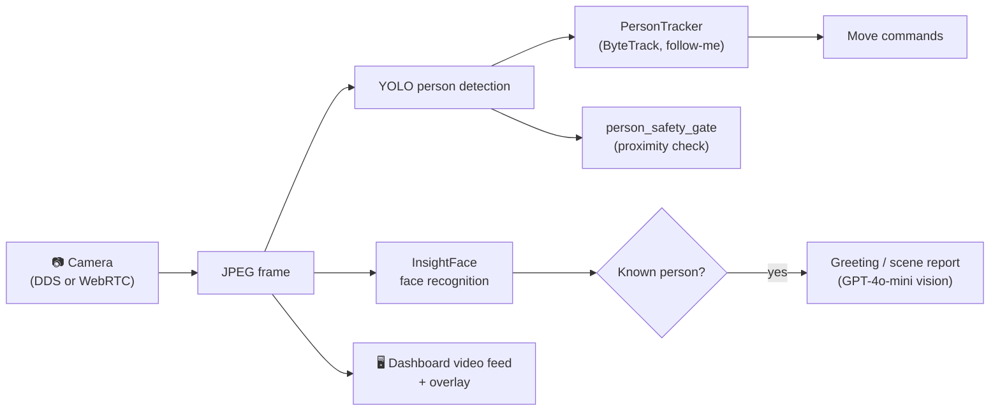

# Go2 AI Dashboard — Unitree SDK2 Python + Custom Robot App

Python interface for the Unitree SDK2, extended with a full application layer
for the **Unitree Go2** quadruped: a web dashboard, bilingual (Korean /
Vietnamese) voice control, autonomous patrol, SLAM waypoint navigation, face
recognition, beat-synced dance, and — the centerpiece — a **three-layer
runtime safety-verification pipeline** that checks every LLM-generated
command before it reaches the robot, plus a hardware-independent emergency
stop that works even if the LLM is compromised.

The vendor SDK (`unitree_sdk2py/`, `example/`) is the official
[unitreerobotics/unitree_sdk2_python](https://github.com/unitreerobotics/unitree_sdk2_python)
and is unmodified. Everything under `app/`, `benchmarks/`, and `docs/` is
custom, built on top of it.



*Dashboard UI walking through its tabs — recorded with no robot connected, so
the camera panel shows "no signal"; every control, the AI command panel, the
D-pad, SLAM waypoints and the analytics view are the real, running app.*

## Table of Contents

- [Key Features](#key-features)
- [Screenshot](#screenshot)
- [Project Structure](#project-structure)
- [Data Flow](#data-flow)
- [The Safety Verification Pipeline](#the-safety-verification-pipeline)
- [Requirements](#requirements)
- [Installation](#installation)
- [Configuration](#configuration)
- [Quick Start — Web Dashboard](#quick-start--web-dashboard-recommended)
- [Quick Start — Terminal / Legacy CLI](#quick-start--terminal-mode-legacy)
- [Voice Command Examples](#voice-command-examples-한국어)
- [Testing & Benchmarks](#testing--benchmarks)
- [Network Modes (LAN vs. WiFi Hotspot)](#network-modes-lan-vs-wifi-hotspot)
- [Known Limitations](#known-limitations--honesty-notes)
- [Credits](#credits)
- [License](#license)

> The original, unmodified Unitree SDK documentation (DDS examples,
> high/low-level control) moved to [`docs/VENDOR_SDK.md`](docs/VENDOR_SDK.md)
> to keep this page focused on the custom Go2 application.

## Key Features

| Area | What it does | Where |
|---|---|---|
| 🎙️ **Voice control** | Korean/Vietnamese speech → Whisper STT → GPT-4o-mini → structured action sequence → robot, with TTS feedback | `app/voice/` |
| 🖥️ **Web dashboard** | Single-page control center: live camera, AI command panel, manual D-pad, patrol, person tracking, SLAM map, analytics | `app/web/dashboard_server.py` |
| 🛡️ **Runtime safety verification** | Three independent layers (schema → intent → context) gate every generated command; see below | `app/safety/` |
| 🧍 **Hard person-safety gate** | Camera-based YOLO person detection that blocks forward motion — deliberately **not** LLM-based, so its failure modes are uncorrelated with the LLM's | `app/vision/person_safety_gate.py` |
| 🚶 **Autonomous patrol** | Fixed-route patrol with face recognition and a spoken scene report when it encounters a person | `app/navigation/auto_patrol.py` |
| 🗺️ **SLAM navigation** | Drive to a named, saved waypoint using the onboard L1 lidar's SLAM pose | `app/navigation/slam_navigator.py` |
| 👁️ **Person following** | YOLO + ByteTrack-based "follow me" with a tuned turn/creep controller | `app/web/dashboard_server.py` (`PersonTracker`) |
| 🙂 **Face recognition** | Register a person by name/title once; the robot recognizes and greets them afterward | `app/vision/camera_vision_download/` |
| 💃 **Beat-synced dance** | LLM-choreographed, beat-detected dance routines from an arbitrary audio file | `app/dance/` |
| 📊 **Analytics** | Every command's latency, success/failure, and safety-layer verdict logged to SQLite and shown in the dashboard | `app/analytics/` |

## Screenshot



The original design mockup this UI was built from is in
[`docs/design/`](docs/design/).

## Project Structure

```
unitree_sdk2_python/
├── unitree_sdk2py/              Official Unitree SDK2 — unmodified
├── example/                     Official SDK examples (helloworld, high/low level, ...)
├── vendor/
│   └── unitree_webrtc_connect/  Vendored WebRTC client, used when the robot
│                                 is reached over its own WiFi hotspot (the
│                                 DDS RPC services aren't reachable there)
│
├── app/                          ← custom application layer
│   ├── core/        robot_controller, action_registry/_merge, behavior_schema/
│   │                 _library/_executor, webrtc_sport_client — the action
│   │                 layer every other subsystem calls to move the robot
│   ├── voice/        voice_control_go2, realtime_stt_pipeline (Whisper STT),
│   │                 wake_word_listener, webrtc_audio_hub (TTS), full_voice_pipeline
│   ├── vision/        camera_vision_download/ (face recognition), camera_stream,
│   │                 person_safety_gate (hard, non-LLM safety gate)
│   ├── navigation/   slam_navigator, auto_patrol, lidar_off, waypoints.json
│   ├── safety/        runtime_verification (V_s/V_i/V_c pipeline),
│   │                 verification_config, intent_verifier
│   ├── analytics/     command history / latency / safety-rejection log (SQLite)
│   ├── dance/         beat-synced choreography (LLM-generated, cached)
│   ├── web/           dashboard_server.py — the main entry point
│   ├── legacy/        main_go2.py, go2_agent/ — terminal-only mode that
│   │                 pre-dates the dashboard; still works
│   ├── tools/         one-off diagnostic scripts (test_wifi_dds.py, ...)
│   ├── archive/       superseded prototypes, kept for history
│   └── tests/         plain-assert test scripts
│
├── benchmarks/        Verification-pipeline benchmark harness + corpus + results
└── docs/               README extras, demo media, presentation, figures
```

## Data Flow

### Voice command → robot action

Every generated command is treated as untrusted until it clears a fixed
pipeline — nothing skips straight from "LLM said so" to "robot moves":



The person-safety gate runs first and is **never** gated by config — it's
the one check that stays on even in the no-protection benchmark baseline
(C0). V_s/V_i/V_c run after it, in cost order, each short-circuiting on
rejection. See [The Safety Verification Pipeline](#the-safety-verification-pipeline)
for why the gate has to be a separate, non-LLM mechanism.

### Vision data flow



The same camera frame feeds three independent consumers — tracking, the
safety gate, and face recognition — so a failure in one (e.g. no face
registered) never blocks the others.

## The Safety Verification Pipeline

A command generated by the LLM is not trusted by default — it passes through
`verify_sequence()` (`app/safety/runtime_verification.py`), which runs the
person-safety gate first, then three independent layers in cost order:

1. **V_s — Schema** (local, cheapest): are the action names and parameters
   within valid, declared ranges?
2. **V_i — Intent consistency** (one LLM call, independent of the generator):
   does the chosen action sequence plausibly match what the user actually
   asked for? Catches a generator that quietly does something unrelated to
   the instruction.
3. **V_c — Context-aware gating** (telemetry read): is the command safe
   *given current robot state* — battery level, obstacle distance, posture?

Each layer can be toggled independently (`app/safety/verification_config.py`)
to reproduce the paper's C0–C3 ablation configurations, and
`benchmarks/run_verification_benchmark.py` runs the full corpus through all
of them, dry-run by default (no hardware touched), to produce accept/reject
and per-layer-latency numbers.

**None of the three layers above protect against a user who directly and
unambiguously asks the robot to do something unsafe** — a consistency check
can't catch "the robot correctly did what was asked." That's why the
person-safety gate (`app/vision/person_safety_gate.py`) is a separate, hard,
**non-LLM** mechanism: plain YOLO person detection that refuses a forward
move if someone is directly in the robot's path, regardless of what any LLM
says. It never reads the instruction text, so its failure modes are not
correlated with the LLM generator's or verifier's.

```bash
python3 app/tests/test_runtime_verification.py
python3 app/tests/test_person_safety_gate.py
```

## Requirements

- Python >= 3.8 (tested on 3.10)
- Ubuntu 20.04/22.04 recommended (matches the vendor SDK's tested environment)
- A Unitree Go2 (any variant) reachable either via Ethernet (`192.168.123.x`)
  or its own WiFi hotspot (`192.168.12.x`) — see
  [Network Modes](#network-modes-lan-vs-wifi-hotspot)
- An OpenAI API key (voice understanding, intent verification, scene
  description)
- A microphone/speakers if you want voice control from your own machine
  (the dashboard also supports the robot's onboard mic for wake-word)

## Installation

```bash
git clone <this-repo-url>
cd unitree_sdk2_python

# 1. Vendor SDK (talks to the robot over DDS)
pip3 install -e .
# If this fails with "Could not locate cyclonedds", see the FAQ in
# docs/VENDOR_SDK.md

# 2. Vendored WebRTC client (talks to the robot over its own WiFi hotspot)
pip3 install -e vendor/unitree_webrtc_connect

# 3. Application dependencies
pip3 install -r requirements.txt
```

## Configuration

```bash
cp .env.example .env
# then edit .env and set:
#   OPENAI_API_KEY="sk-..."
```

Every entry point loads `.env` by searching **upward from the current
working directory**, so placing it at the repo root (as above) works
regardless of which subfolder you run a script from. You can also pass the
key directly: `--openai-key sk-...` on most entry points, or export
`OPENAI_API_KEY` in your shell.

> `.env` is git-ignored (see `.gitignore`) and must never be committed. If
> you fork or copy this project, double-check `git log -p -- .env` on your
> own history before making a private clone public.

## Quick Start — Web Dashboard (recommended)

```bash
export OPENAI_API_KEY="sk-..."
python3 app/web/dashboard_server.py --robot-ip 192.168.123.18
# open http://localhost:8080
```

Voice control, person-following, auto-patrol, SLAM waypoint navigation,
safety-verification stats and analytics are all available from this one
dashboard.

```bash
python3 app/web/dashboard_server.py --help
```

```
--robot-ip IP        Robot address (default 192.168.123.18, LAN mode)
--robot-name NAME     Display name shown in the UI (default GO2-01)
--port PORT           Dashboard HTTP port (default 8080)
--openai-key KEY      Overrides OPENAI_API_KEY
--model MODEL         OpenAI model for command generation (default gpt-4o-mini)
--no-wake-word         Disable the always-listening wake word (WiFi mode only)
```

## Quick Start — Terminal Mode (legacy)

A terminal-only mode that pre-dates the dashboard. Still fully functional —
useful if you don't want to run a web server, or want a minimal reference
for building your own integration.

```bash
export OPENAI_API_KEY="sk-..."

# Full pipeline with TTS feedback
python3 app/legacy/main_go2.py --mode pipeline

# Voice control only (no TTS)
python3 app/legacy/main_go2.py --mode interactive

# Test robot commands without a microphone
python3 app/legacy/main_go2.py --mode test --robot-ip 192.168.12.1
```

**Pipeline:** 🎤 voice → Whisper STT → OpenAI GPT-4o → structured JSON →
`RobotController` → 🤖 Go2 → 🔊 TTS.

See [`docs/VOICE_CONTROL_README.md`](docs/VOICE_CONTROL_README.md) for the
full write-up, including the intelligent-agent mode (`app/legacy/go2_agent/`).

## Voice Command Examples (한국어)

| Say | Action |
|---|---|
| "하트 포즈하고 점프해" | balanced_stand → free_jump (sequence) |
| "앞으로 가" | move forward |
| "점프" | free_jump |
| "백플립" | back_flip |
| "물구나무" | hand_stand |
| "멈춰" | stop_move |
| "종료" | exit session |

## Testing & Benchmarks

None of these touch the physical robot unless `--live` is explicitly passed.

```bash
python3 app/tests/test_voice_control_setup.py   # environment/dependency check
python3 app/tests/test_go2_behaviors.py
python3 app/tests/test_runtime_verification.py
python3 app/tests/test_person_safety_gate.py

# Verification-pipeline benchmark (dry-run by default)
python3 benchmarks/run_verification_benchmark.py --configs C1
python3 benchmarks/run_verification_benchmark.py --configs C0 C1 C2 C3 --repeats 3

# Add --live --robot-ip <ip> for physical-latency numbers on real hardware,
# and --confirm-each-action to approve every command by hand first.
```

## Network Modes (LAN vs. WiFi Hotspot)

The Go2 exposes two different connection paths, and the app auto-detects
which one it's talking to based on the IP you pass:

| | Ethernet / LAN (`192.168.123.x`) | Robot's own WiFi hotspot (`192.168.12.x`) |
|---|---|---|
| Transport | Raw DDS (`unitree_sdk2py`) | WebRTC data channel (`vendor/unitree_webrtc_connect/`) |
| Typical use | Development on a desk, cable to the robot | Field use, no cable |
| Wake word / onboard mic | Not available | Available (`--no-wake-word` to disable) |

If you see a DDS RPC timeout (`RPC_ERR_CLIENT_SEND`, code 3102) while on
WiFi, that's expected — the DDS services aren't reachable through the
hotspot; everything in this app already routes through WebRTC automatically
in that case.

## Known Limitations / Honesty Notes

This project is transparent in its own code comments about what has and
hasn't been validated on real hardware — worth repeating here rather than
overselling in a README:

- `app/navigation/auto_patrol.py` is an explicit v1: a fixed there-and-back
  route, not closed-loop SLAM — see its module docstring for why.
- `app/navigation/slam_navigator.py`'s control loop is confirmed to connect
  and stream pose data live, but the drive/turn gains are a starting point,
  not yet tuned against real-world measurement.
- `app/vision/person_safety_gate.py` uses bounding-box area as a proximity
  proxy, not true depth — conservative by design, but not a calibrated
  metric distance.
- The benchmark numbers in `benchmarks/*.csv` are dry-run (verification
  decision only) unless the filename says otherwise; see
  `run_verification_benchmark.py --help` for `--live`.

## Credits

- [unitreerobotics/unitree_sdk2_python](https://github.com/unitreerobotics/unitree_sdk2_python) —
  the vendor SDK this project is built on (BSD-3-Clause, unmodified).
- [`unitree_webrtc_connect`](vendor/unitree_webrtc_connect/README.md) —
  vendored WebRTC client used for WiFi-hotspot connections.
- Ultralytics YOLO, InsightFace, Faster-Whisper, OpenAI — the ML components
  this app composes rather than retrains.

Full original Unitree SDK documentation (DDS examples, high/low-level
control): [`docs/VENDOR_SDK.md`](docs/VENDOR_SDK.md).

## License

The vendor SDK (`unitree_sdk2py/`, `example/`) is BSD-3-Clause, Copyright
Unitree Robotics — see [`LICENSE`](LICENSE). The custom `app/` layer is
original work built on top of it under the same repository.
